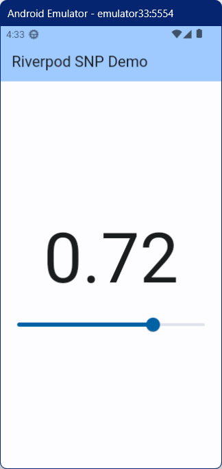

## Riverpod StateNotifierProvider Demo

Riverpod の StateNotifierProvier を使ったデモ

### パッケージのインストール

flutter_riverpod パッケージをインストールする

``` console
flutter pub add flutter_riverpod
```

### 動作イメージ

シンプルなスライダーアプリ



### ポイントとなる部分の整理

#### 1. Provider

- 1-1. グローバル変数に Provider を定義する

  - StateNotifierProvider<MyData, double>((ref) => MyData())
  - グローバル変数で StateNotiferProvider を準備する

- 1-2. ProviderScope を設定する

  - runApp(const ProviderScope(child: MyApp()))
  - アプリ内で Provider を使えるようにする

グローバル変数に StateNotifierProvider を準備することで、どこからでも参照できる。

#### 2. Text

- 2-1. Text 用に Consumer を使う

  - Consumer(builder: (context, ref, child) {...})
  - データの受け取り部分を簡素に実装するために、Consumer を利用する

- 2-2. ref を用いて state の値を取り出す

  - ref.watch(myDataProvider)
  - ref.watch にプロバイダを渡すと MyData の state の値を取得できる

Text の部分では Consumer を利用している。

プロバイダの値にアクセスするために ref を用いており、ref.watch はプロバイダの値を監視し、値に変更があるたびにウィジェットの再描画を行う。

#### 3. Slider

- 3-1. Slider 用に Consumer を使う

  - Consumer(builder: (context, ref, child) {...})
  - データの受け取り部分を簡素にするために、Consumer を利用する

- 3-2. ref を用いて state の値を取り出す

  - value: ref.watch(myDataProvider)
  - ref.watch にプロバイダを渡すと MyData の state の値を取得できるめ、スライダーの値にする

- 3-3. changeState で状態を変える

  - ref.read(myDataProvider.notifier).changeState(value)
  - ref.read にプロバイダを渡すと MyData を取得できるため、取得した MyData から changeState メソッドを呼んで値を更新する

最後に Slider の部分だが、ここでも Consumer を利用している。

スライダーの value を設定する値は、Text と同じく ref.watch を使い state の値を取得している。

スライダーの値の変更時のイベントは、変更後の値を MyData の changeState メソッドに渡して状態を変えている。
